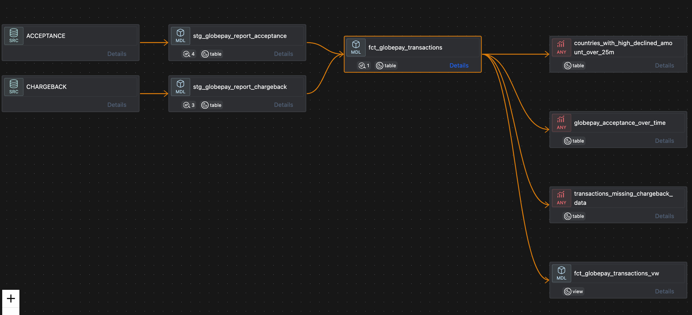
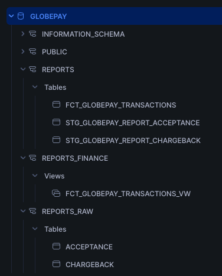

# DeelDataAnalyticsEngTask
Deel Analytics Engineer Task Solution Proposal


## Initial set-up
I decided to use DBT as data transformation tool and Snowflake as database managing system. The main motivation was to mimic the stack used by Deel.

A 30 day free-trial account was created on Snowflake.

For DBT we are going to use the Open Source distribution (dbt_core) on version 1.8 .

And to connect DBT to Snowflake we are going to use a private and public key pair.
To create the keys: [Snowflake documentation](https://docs.snowflake.com/en/user-guide/key-pair-auth#configuring-key-pair-authentication)

A database called GLOBEPAY was created for this scenario

## Preliminary data exploration
The Snowflake **"Load data into Table"** feature was used to import the two CSV files provided as tables on Snowflake. The tables `ACCEPTANCE` and `CHARGEBACK` were created on a schema named `REPORTS_RAW`. Each one containing the respective raw data from the two files provided.

The schema `REPORTS_RAW` is going to be used to accommodate raw data tables. In a real world scenario new responses from the Globepay API would be saved to a external data source such as S3 buckets and a Snowflake Stage used to move their data to internal Snowflake tables.

Using Snowflake to query the two raw data tables, we can see that the column `external_ref` contains the join keys for the `ACCEPTANCE` and `CHARGEBACK` tables.

The schema `REPORTS` will accommodate most of the tables that we are going to create using DBT models.

In our DBT project we will create a YAML file called `src_globepay.yml` in the path `models/sources/`. This file will declare our raw data tables created directly on Snowflake as dbt sources.

Now create two models inside the `models/staging/` path. Those models are going to be our **staging tables**, one for each source. `stg_globepay_report_chargeback.sql` and `stg_globepay_report_acceptance.sql` .

Now we are going to explore the data in more detail.
Checks made by Joining the two tables using the `external_ref` column:
* There are no rows were the `status` column value is different when comparing `stg_globepay_report_chargeback` and `stg_globepay_report_acceptance`
*  Both `stg_globepay_report_chargeback` and `stg_globepay_report_acceptance` have only the value `"GLOBALPAY"` on the column `source`
* The `ref` column from `stg_globepay_report_acceptance` is unique
* The column `rates` from `stg_globepay_report_acceptance` have JSON strings

## DBT architecture
```
ROOT
├── dbt_project.yml
├── models
│   ├── sources
│   │   └── src_globepay.yml
│   ├── staging
│   │   ├── stg_globepay_report_acceptance.sql
│   │   ├── stg_globepay_report_chargeback.sql
│   │   └── globepay.yml
│   ├── intermediate
│   │   ├── fct_globepay_transactions.sql 
│   │   └── globepay.yml
│   ├── marts
│   │   └── finance
│   │       └── fct_globepay_transactions_vw.sql
├── analysis
│   ├── globepay_acceptance_over_time.sql
│   ├── countries_with_high_declined_amount_over_25m.sql
│   └── transactions_missing_chargeback_data.sql
└── README.md
```

---

1. The `src_globepay.yml` file will have both `globepay.ACCEPTANCE` and `globepay.CHARGEBACK` **Sources**. The description of each column from both sources will also be there.  
2. **Staging tables** will have a 1-to-1 relation with each **Source**.  
3. The `globepay.yml` file inside `models/staging` will have some tests:  
    3.1. On `stg_globepay_report_acceptance`, the columns `ref` and `external_ref` will have `unique` and `not_null` tests.  
    3.2. On `stg_globepay_report_chargeback`, the column `external_ref` will have `unique` and `not_null` tests and column `chargeback` will have a `not_null` test.  
4. The `models/intermediate/` path will accommodate models with specific purposes, like `fct_globepay_transactions.sql`, which is a **Fact table**, built with the intention to answer the questions made by the Data Analyst in this task.  
5. `models/intermediate/` will also have a `globepay.yml` file, this one containing tests for the `fct_globepay_transactions`. A `not_null` test for the `chargeback`.  
6. The `models/marts/finance` path will have a model that will be a view for the `fct_globepay_transactions`, called `fct_globepay_transactions_vw`. In the `dbt_project.yml` file we included a configuration to use a different schema for the models created inside `models/marts/finance/`. The intension here is to enable a safe way to share the Fact table with business users if needed, since we can add different access permissions based on the schema. Models will be created inside the `REPORTS_FINANCE` schema.  
7. As a good practice, a **tag** called `globepay` was included in every model created for this context. This enable us to select models by tag when running DBT commands.  
8. Inside the `analysis/` folder three SQL files were created, each one answering one of the questions from the Data Analyst. SQL files inside the `analysis/` path do not work like DBT models, they are not executed by DBT commands, they work more like saved queries. Those SQL files can be run as queries on DBT or they can be compiled and shared to be executed on BI tools.  


## Resulting DBT lineage


## Resulting Snowflake database schemas
